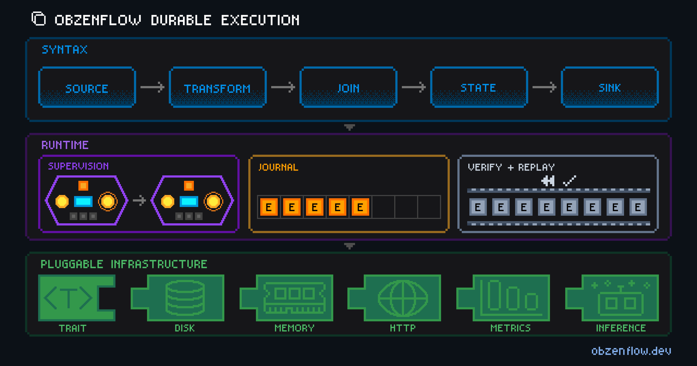

  

  # ObzenFlow

  ObzenFlow is a durable execution runtime in Rust for building high-consequence
  systems.

  Every stage of a flow records what happened, including decisions and effect
  outcomes, to ordered append-only journals. That record lets the runtime rebuild
  state, verify a replay against the original run, and resume interrupted work without
  re-firing committed effects.

  

  ## What We’re Building

  - **Durable execution in Rust**: rebuild, verify, and resume flows from their own
  journals.
  - **Typed flow topology**: model sources, transforms, joins, stateful stages, sinks,
  and effects as compiler-checked edges.
  - **First-class effects**: declare external calls, record their outcomes, and
  suppress committed effects during replay.
  - **Operational evidence**: make topology, runtime state, middleware behaviour, and
  contract evidence inspectable.
  - **Single-binary deployments**: run durable applications without adopting a broker,
  cluster, database, or orchestration platform as the source of correctness.

  ## Repositories

  - [`obzenflow`](https://github.com/ObzenFlow/obzenflow): the main durable execution
  runtime, DSL, examples, adapters, journals, replay, resume, and operational surface.
  - [`obzenflow-topology`](https://github.com/ObzenFlow/obzenflow-topology): WASM-
  friendly graph representation and validation for flow and pipeline topologies.
  - [`obzenflow-idkit`](https://github.com/ObzenFlow/obzenflow-idkit): a tiny Rust
  library for phantom-typed ULIDs.
  - [`obzenflow-fsm`](https://github.com/ObzenFlow/obzenflow-fsm): async-first finite
  state machine primitives for Rust.

  ## Contributing

  Contributions are welcome across code, documentation, examples, integrations, bug
  reports, and design feedback.

  Start with the [`obzenflow`](https://github.com/ObzenFlow/obzenflow) repo and read
  the [`contributing guide`](https://github.com/ObzenFlow/obzenflow/blob/main/CONTRIBUTING.md). ObzenFlow uses DCO sign-off instead of a CLA, so commits should be
  signed with `git commit -s`.

  Please follow the [Code of Conduct](https://github.com/ObzenFlow/obzenflow/blob/main/CODE_OF_CONDUCT.md). For security issues, use the [security policy](https://github.com/ObzenFlow/obzenflow/blob/main/SECURITY.md).

  ## Learn More

  - [Website](https://obzenflow.dev/)
  - [What is ObzenFlow?](https://obzenflow.dev/product/what-is-obzenflow/)
  - [How ObzenFlow Works](https://obzenflow.dev/product/how-obzenflow-works/)
  - [Tutorials](https://obzenflow.dev/tutorials/)

  ## Status

  ObzenFlow is pre-1.0. APIs are still evolving and may change between releases.

  ## License

  The public Rust crates are licensed under MIT or Apache-2.0, at your option.
